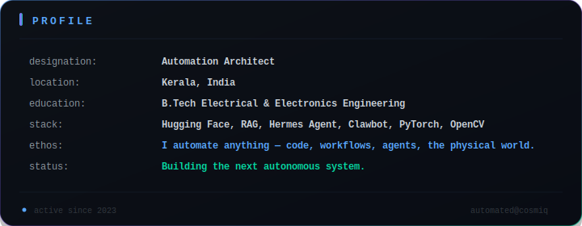

  

  

 

  
  
  
  

 
 

 

  

 

 
 

<!-- GRID + ABOUT -->
<table>
<tr>
<td width="60%" valign="top">

### the mission

I build systems that make other work obsolete.

Electrical & Electronics Engineering student who crossed into AI and never looked back. I've built autonomous agents that hunt freelance jobs while you sleep, visual intelligence platforms that search CCTV footage with natural language, and RAG pipelines that give machines memory.

I work with **Hugging Face**, **RAG**, **Hermes Agent**, **Clawbot**, **PyTorch**, **OpenCV** — whatever it takes to make a system run itself.

**If it can be automated, I automate it.**

</td>
<td width="40%" align="center" valign="top">

</td>
</tr>
</table>

 

  

 

<b>highlights</b>

 

  

 

<table>
<tr>
<td width="33%" align="center">🏆 <b>National AIR 1</b> ARC Dubai 2024</td>
<td width="33%" align="center">📜 <b>Patent Filed</b> Battery-free biometrics</td>
<td width="33%" align="center">⚡ <b>1,500+</b> Contributions this year</td>
</tr>
</table>

 

<table>
<tr>
<td width="50%">

**PhotonIQ** — AI visual intelligence platform. Search CCTV footage with natural language.

</td>
<td width="50%">

**Perpetual** — Autonomous agent that finds and wins freelance jobs. You sleep — it works.

</td>
</tr>
<tr>
<td width="50%">

**Bounty-Hunters** — Fixed Solidity vulns (LiquidityPool, CrossChainBridge, MultiSigWallet).

</td>
<td width="50%">

**Pipedream** — Contributed actions (Voice Download, LinkupAPI V2) to 11.5k star repo.

</td>
</tr>
</table>

 
 

 

## arsenal

 

  
  
  
  

  
  
  
  
  
  
  

  
  
  
  

 

 

## builds

 

<table>
<tr>
<td width="50%" valign="top">

### [PhotonIQ](https://github.com/hanu-14/photoniq)

> Search CCTV footage with natural language. AI visual intelligence.

`PyTorch` `RT-DETR` `OpenCV` `FastAPI`

</td>
<td width="50%" valign="top">

### [Perpetual](https://github.com/hanu-14/perpetual)

> An autonomous agent that finds, applies, and wins freelance jobs.

`Python` `Hermes Agent` `Automation` `Telegram API`

</td>
</tr>
<tr>
<td width="50%" valign="top">

### [CosmIQ](https://github.com/hanu-14/cosmiq)

> AI automation tools, developer products, and systems that run themselves.

`AI` `Automation` `RAG` `Developer Tools`

</td>
<td width="50%" valign="top">

### [Computer Vision](https://github.com/hanu-14/computer-vision)

> Object detection, inference optimization, model evaluation.

`PyTorch` `OpenCV` `Clawbot` `RT-DETR`

</td>
</tr>
</table>

 

 

## grind

 

  

 

  

 

 

## bounties

 

<table>
<tr>
<th>repo</th>
<th>hit</th>
</tr>
<tr>
<td>UnsafeLabs/Bounty-Hunters</td>
<td>LiquidityPool — first-depositor manipulation fix</td>
</tr>
<tr>
<td>UnsafeLabs/Bounty-Hunters</td>
<td>CrossChainBridge — replay attack fix</td>
</tr>
<tr>
<td>UnsafeLabs/Bounty-Hunters</td>
<td>MultiSigWallet — confirmation race condition fix</td>
</tr>
<tr>
<td>PipedreamHQ/pipedream</td>
<td>Download Voice Message action (new)</td>
</tr>
<tr>
<td>PipedreamHQ/pipedream</td>
<td>LinkupAPI V2 — auth update</td>
</tr>
</table>

 

 

## right now

 

  <code>🏗️ building</code> CosmIQ — autonomous agent suite 
  <code>📚 learning</code> Distributed systems, advanced RAG, agent orchestration 
  <code>🎯 hunting</code> Open source bounties across high-impact repos 
  <code>📖 reading</code> AI papers, system design, embedded systems 

 

 

## connect

 

  
  
  
  

 

  

 

  

